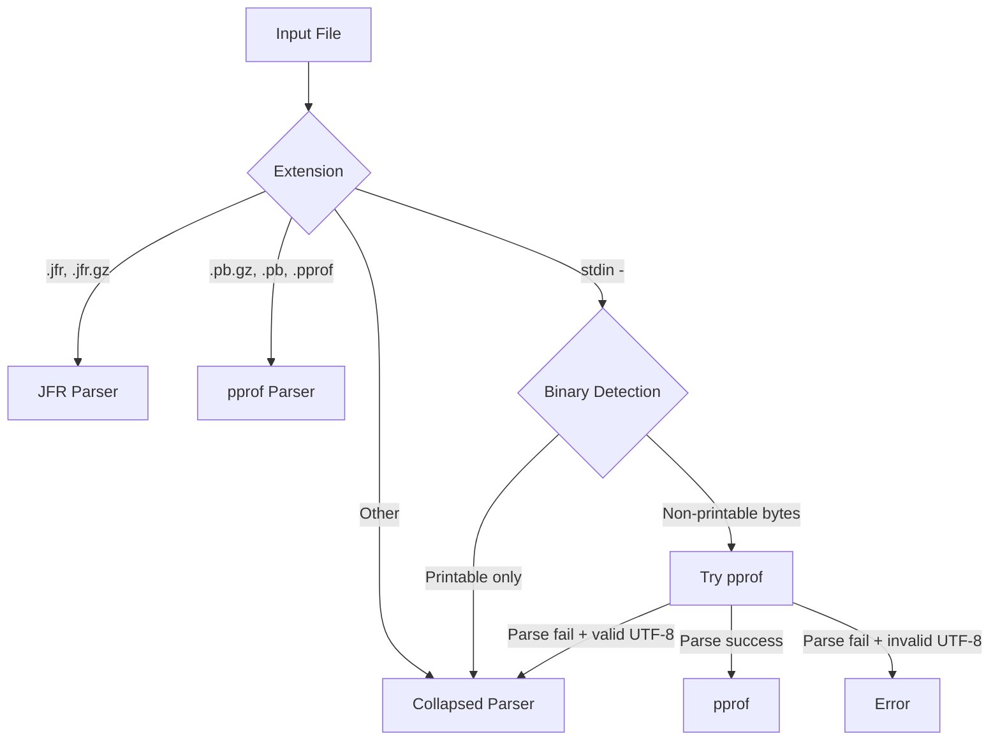

ap-query supports three input formats with automatic format detection. Each format has different capabilities and use cases.

## Format Overview

| Format | Extensions | Event Types | Line Numbers | Timestamps | Timeline |
|--------|-----------|-------------|--------------|------------|----------|
| **JFR** | `.jfr`, `.jfr.gz` | ✓ | ✓ | ✓ | ✓ |
| **pprof** | `.pb.gz`, `.pb`, `.pprof`, `.pprof.gz` | ✓ | ✓ | ✗ | ✗ |
| **Collapsed** | All others | ✗ | Optional | ✗ | ✗ |

<Info>
**Recommendation:** Always prefer JFR or pprof over collapsed text. Both preserve event types, line numbers, and thread information that collapsed text loses.
</Info>

## JFR Format (Full Feature Set)

JFR (Java Flight Recorder) is the native async-profiler output format. It provides the complete feature set.

### Recording JFR Profiles

```bash
# CPU profiling (default)
asprof -d 30 -o jfr -f profile.jfr <pid>

# Wall-clock profiling  
asprof -d 30 -e wall -o jfr -f profile.jfr <pid>

# Compressed output (recommended for large profiles)
asprof -d 30 -o jfr -f profile.jfr.gz <pid>
```

### JFR Capabilities

<Tabs>
  <Tab title="Event Types">
    JFR preserves all event types recorded by async-profiler:

    - `ExecutionSample` → cpu or hardware counter (e.g., branch-misses)
    - `WallClockSample` → wall
    - `ObjectAllocationInNewTLAB` / `ObjectAllocationOutsideTLAB` / `ObjectAllocationSample` → alloc
    - `JavaMonitorEnter` → lock

    The event type is stored in `jdk.ActiveSetting` records and mapped automatically (`parse.go:536-551`):

    ```go
    if typ == p.TypeMap.T_ACTIVE_SETTING {
        s := p.ActiveSetting
        if s.Name == "event" {
            execEventName = normalizeExecEvent(s.Value)
            // Dynamic event discovery for hardware counters
        }
    }
    ```

    This allows ap-query to handle any hardware counter event recorded by async-profiler.
  </Tab>
  <Tab title="Timestamps">
    JFR records per-sample timestamps, enabling:

    - **Timeline visualization:** `ap-query timeline profile.jfr`
    - **Time-range filtering:** `--from 12s --to 14s`
    - **Time-window comparison:** `diff profile.jfr --from ... --vs-from ...`

    Timestamps are converted from JFR ticks to nanoseconds (`parse.go:338-350`):

    ```go
    func ticksToNanos(startTicks, hdrStartTicks, hdrStartNanos, originNanos, tps uint64) int64 {
        if tps == 0 {
            return 0
        }
        delta := startTicks - hdrStartTicks
        sec := delta / tps
        rem := delta % tps
        return int64(hdrStartNanos-originNanos) +
            int64(sec)*1_000_000_000 +
            int64(rem)*1_000_000_000/int64(tps)
    }
    ```

    This overflow-safe conversion supports recordings of any duration.
  </Tab>
  <Tab title="Recording Span">
    JFR chunk headers contain recording duration, enabling:

    - Time-range validation (warn if `--from` is beyond recording end)
    - Timeline bucket sizing
    - Duration display in `info` output

    Span calculation scans all chunk headers (`parse.go:356-400`):

    ```go
    func scanChunkHeaders(buf []byte) (originNanos int64, spanNanos int64, err error) {
        // Read linked 68-byte chunk headers
        for pos+jfrChunkHeaderSize <= len(buf) {
            startNanos := binary.BigEndian.Uint64(buf[pos+32:])
            durationNanos := binary.BigEndian.Uint64(buf[pos+40:])
            // Track origin and max end
        }
    }
    ```
  </Tab>
  <Tab title="Thread Names">
    JFR includes thread metadata (Java thread names and OS thread names):

    ```go
    func resolveThread(p *parser.Parser, ref types.ThreadRef) string {
        idx, ok := p.Threads.IDMap[ref]
        if !ok {
            return ""
        }
        t := &p.Threads.Thread[idx]
        if t.JavaName != "" {
            return t.JavaName
        }
        return t.OsName
    }
    ```

    This powers the `-t` thread filter and `threads` command.
  </Tab>
</Tabs>

### JFR File Structure

JFR files consist of linked chunks:

- **68-byte headers** with magic `0x464c5200`, size, start time, duration, and ticks-per-second
- **Event stream** with type IDs, stack traces, and thread references
- **Metadata** defining event types and symbol tables

ap-query uses [grafana/jfr-parser](https://github.com/grafana/jfr-parser) for parsing.

## pprof Format (Cross-Language Support)

pprof is the profiling format used by Go, Rust (pprof-rs), Python (py-spy), and many other ecosystems.

### Recording pprof Profiles

```bash
# From Go runtime
curl http://localhost:6060/debug/pprof/profile?seconds=30 > profile.pb.gz

# From async-profiler (alternative to JFR)
asprof -d 30 -o pprof -f profile.pb.gz <pid>

# From py-spy
py-spy record --format pprof -o profile.pb.gz -- python app.py
```

### pprof Capabilities

<Tabs>
  <Tab title="SampleType Mapping">
    pprof profiles contain multiple `SampleType` fields (cpu/nanoseconds, samples/count, etc.). ap-query maps these to event types automatically (`pprof.go:42-68`):

    ```go
    func classifyPprofSampleType(st *profile.ValueType) (eventType string, priority int) {
        typ := strings.ToLower(st.Type)
        unit := strings.ToLower(st.Unit)

        switch {
        case typ == "cpu" && unit == "nanoseconds":
            return "cpu", 2
        case typ == "samples" && unit == "count":
            return "cpu", 1
        case typ == "alloc_space" && unit == "bytes":
            return "alloc", 2
        // ... more mappings
        }
    }
    ```

    When multiple SampleTypes map to the same event, the highest-priority wins (e.g., `alloc_space/bytes` over `alloc_objects/count`).
  </Tab>
  <Tab title="Stack Resolution">
    pprof locations are leaf-first with inline expansion. ap-query reverses to root-first for collapsed format compatibility (`pprof.go:182-226`):

    ```go
    func resolvePprofStack(sample *profile.Sample) ([]string, []uint32) {
        // Count inlined frames
        total := 0
        for _, loc := range sample.Location {
            if len(loc.Line) == 0 {
                total++ // unsymbolized
            } else {
                total += len(loc.Line)
            }
        }

        // Reverse to root-first order
        frames := make([]string, total)
        lines := make([]uint32, total)
        idx := total - 1

        for _, loc := range sample.Location {
            for _, line := range loc.Line {
                frames[idx] = line.Function.Name
                lines[idx] = uint32(line.Line)
                idx--
            }
        }

        return frames, lines
    }
    ```
  </Tab>
  <Tab title="Thread Labels">
    pprof stores thread information in sample labels:

    ```go
    func extractPprofThread(sample *profile.Sample) string {
        for k, v := range sample.Label {
            if k == "thread" && len(v) > 0 {
                return v[0]
            }
        }
        for k, v := range sample.NumLabel {
            if k == "thread_id" && len(v) > 0 {
                return fmt.Sprintf("thread-%d", v[0])
            }
        }
        return ""
    }
    ```

    Not all pprof producers include thread labels. Go runtime profiles typically don't have per-sample thread info.
  </Tab>
</Tabs>

### pprof Limitations

<Warning>
pprof does **not** support:

- **Timeline visualization** — no per-sample timestamps
- **`--from`/`--to` filtering** — cannot filter by time range
- **Time-window comparison** — cannot compare windows within one file

These features require JFR format.
</Warning>

### pprof File Structure

pprof uses Protocol Buffers (`.proto`):

- **Profile** message with sample types, samples, locations, functions, strings
- **Sample** with location IDs and values (one per sample type)
- **Location** with address, mapping, and line entries (for inlining)
- **Function** with name, filename, system name

ap-query uses [google/pprof](https://github.com/google/pprof) for parsing.

## Collapsed-Stack Text Format

Collapsed-stack format is the simplest: one line per unique stack, with sample count.

### Format Syntax

```
root;child;grandchild;leaf count
```

Examples:
```
main;processRequest;queryDB;executeSQL 42
main;processRequest;renderTemplate 15
[http-nio-8080-exec-1];main;processRequest;queryDB 30
```

### Optional Annotations

Collapsed text supports optional enhancements:

<Accordion title="Thread Names">
  First frame can be `[thread-name]` or `[thread-name tid=123]`:

  ```
  [http-nio-8080-exec-1];main;processRequest;queryDB 30
  [kafka-consumer-1 tid=4567];poll;fetchRecords 18
  ```

  Parsed in `parse.go:701-711`:

  ```go
  func parseThreadFrame(frame string) string {
      if len(frame) < 3 || frame[0] != '[' || frame[len(frame)-1] != ']' {
          return ""
      }
      inner := frame[1 : len(frame)-1]
      // Strip optional " tid=N" suffix
      if idx := strings.Index(inner, " tid="); idx >= 0 {
          inner = inner[:idx]
      }
      return inner
  }
  ```
</Accordion>

<Accordion title="Line Numbers">
  Frames can include `:line` suffixes and `_[type]` annotations (jfrconv format):

  ```
  HashMap.resize:123;HashMap.putVal:456_[i] 10
  ```

  Parsed in `parse.go:713-731`:

  ```go
  func parseAnnotatedFrame(frame string) (string, uint32) {
      // Strip _[...] suffix
      base := frame
      if idx := strings.LastIndex(frame, "_["); idx >= 0 && frame[len(frame)-1] == ']' {
          base = frame[:idx]
      }
      // Parse :line suffix
      colon := strings.LastIndexByte(base, ':')
      if colon < 1 {
          return frame, 0
      }
      ln, err := strconv.ParseUint(base[colon+1:], 10, 32)
      if err != nil {
          return frame, 0
      }
      return base[:colon], uint32(ln)
  }
  ```
</Accordion>

### Creating Collapsed Text

From JFR or pprof:
```bash
ap-query collapse profile.jfr > stacks.txt
ap-query collapse profile.jfr --event wall > stacks-wall.txt
```

From async-profiler directly:
```bash
asprof -d 30 -o collapsed -f stacks.txt <pid>
```

### Collapsed Format Limitations

<Warning>
Collapsed text **does not** support:

- **Event type metadata** — you must know whether stacks are cpu, wall, alloc, or lock
- **`--event` flag** — cannot distinguish event types within the file
- **Timeline** — no timestamps
- **`--from`/`--to`** — no time-range filtering
- **Reliable line numbers** — only if the producer included them

Use collapsed text only when:
- You need to pipe to external tools (flamegraph.pl, speedscope)
- You're receiving profiles from systems that only export collapsed format
- File size is a critical constraint (collapsed is smaller than JFR)
</Warning>

## stdin Input (`-`)

ap-query accepts input from stdin using `-` as the filename. Format is auto-detected:

### Binary Detection

If stdin contains non-printable bytes (control chars, high bytes), ap-query treats it as pprof:

```bash
# From pprof HTTP endpoint
curl -s http://localhost:6060/debug/pprof/profile?seconds=30 | ap-query hot -

# From compressed pprof file
cat profile.pb.gz | ap-query hot -
```

Detection logic (`parse.go:901-912`):
```go
func stdinLooksBinary(data []byte) bool {
    n := len(data)
    if n > 256 {
        n = 256
    }
    for _, b := range data[:n] {
        if b > 0x7e || (b < 0x20 && b != '\n' && b != '\r' && b != '\t') {
            return true
        }
    }
    return false
}
```

### Text Detection

If stdin contains only printable ASCII and whitespace, it's treated as collapsed text:

```bash
# From echo
echo "main;processRequest;queryDB 42" | ap-query hot -

# From file
cat stacks.txt | ap-query hot -

# From ap-query collapse
ap-query collapse profile.jfr | ap-query hot -
```

### UTF-8 Fallback

If binary detection triggers but pprof parsing fails, ap-query falls back to collapsed text if the data is valid UTF-8. This handles collapsed text with non-ASCII method names (e.g., `café`, `日本語`).

## Format Auto-Detection

For file arguments, ap-query detects format by file extension (`parse.go:797-811`):

```go
func detectFormat(path string) profileFormat {
    if path == "-" {
        return formatCollapsed  // stdin uses runtime detection
    }
    p := strings.ToLower(path)
    switch {
    case strings.HasSuffix(p, ".jfr"), strings.HasSuffix(p, ".jfr.gz"):
        return formatJFR
    case strings.HasSuffix(p, ".pb.gz"), strings.HasSuffix(p, ".pb"),
        strings.HasSuffix(p, ".pprof"), strings.HasSuffix(p, ".pprof.gz"):
        return formatPprof
    default:
        return formatCollapsed
    }
}
```

### Detection Flow



## Format Conversion

Convert between formats using `collapse`:

```bash
# JFR → Collapsed (cpu event)
ap-query collapse profile.jfr > cpu.txt

# JFR → Collapsed (wall event)
ap-query collapse profile.jfr --event wall > wall.txt

# pprof → Collapsed
ap-query collapse profile.pb.gz > stacks.txt

# Collapsed → Flamegraph
ap-query collapse profile.jfr | flamegraph.pl > flame.svg
```

<Info>
Collapsed output from `ap-query collapse` includes thread names (when available) and line numbers (when present in the source format).
</Info>

## Gzip Compression

All formats support gzip compression:

- **JFR:** `.jfr.gz` (recommended for profiles >100MB)
- **pprof:** `.pb.gz`, `.pprof.gz` (pprof library handles decompression)
- **Collapsed:** Pipe through `gzip`: `ap-query collapse profile.jfr | gzip > stacks.txt.gz`

ap-query detects gzip by suffix and decompresses automatically.

## Best Practices

### Choose the Right Format

- **Recording new profiles:** Use JFR for full feature set
  ```bash
  asprof -d 30 -o jfr -f profile.jfr <pid>
  ```

- **Cross-language profiling:** Use pprof for Go, Rust, Python, etc.
  ```bash
  curl http://localhost:6060/debug/pprof/profile > profile.pb.gz
  ```

- **Sharing or visualization:** Use collapsed for portability
  ```bash
  ap-query collapse profile.jfr > stacks.txt
  ```

### Avoid Collapsed Text for Analysis

When possible, analyze JFR or pprof directly instead of converting to collapsed:

<Tabs>
  <Tab title="Wrong">
    ```bash
    # Loses event types and line numbers
    ap-query collapse profile.jfr > stacks.txt
    ap-query hot stacks.txt
    ```
  </Tab>
  <Tab title="Right">
    ```bash
    # Preserves all metadata
    ap-query hot profile.jfr
    ap-query hot profile.jfr --event wall
    ```
  </Tab>
</Tabs>

### Use Compression for Large Profiles

```bash
# JFR: compress at recording time
asprof -d 60 -o jfr -f profile.jfr.gz <pid>

# pprof: already compressed by default
curl http://localhost:6060/debug/pprof/profile > profile.pb.gz

# Collapsed: compress output
ap-query collapse large.jfr | gzip > stacks.txt.gz
```

### stdin for Pipelines

Use stdin (`-`) for streaming analysis:

```bash
# Real-time profiling
asprof -d 30 -o collapsed <pid> | ap-query hot -

# Remote profiling
ssh server 'asprof -d 30 -o collapsed <pid>' | ap-query hot -

# Format conversion
ap-query collapse profile.jfr | ap-query hot -
```
